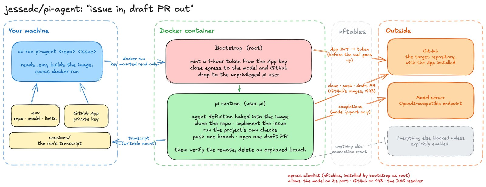

# pi-agent

`pi-agent` is a demonstration of a coding agent. It is an exercise in collating
open source tools and locally run LLMs into a single shot agent that will work
autonomously to solve a GitHub issue and produce a draft pull request.

Put simply, `pi-agent` runs the `pi` coding harness in a locked down docker
container with [instructions](.pi/agents/issue-to-pr.md) on how to operate. The
coding harness is given the bare minimum to do the job.

Although primarily a demonstration, the agent does operate when set up with
simple enough issues and the right GitHub app permissions. My intended type of
LLMs to use for the agent are smaller 30B quantised models like
[DeepSeek V4 Flash](https://github.com/jessedc/llama-docker-gb10/pull/1) and
Qwen3.8 as these can be run cheaply and only trail the foundation models by a
matter of months in terms of coding ability.

The container boundary and overall hardening is a work in progress. See
[SECURITY_REVIEW.md](SECURITY_REVIEW.md) for a list of tasks being chipped away
at to improve the container's general security.

Example PRs produced by `pi-agent`:
- [Example PR #1](https://github.com/jessedc/chatto-on-lightsail/pull/3)
- [Example PR #2](https://github.com/jessedc/chatto-on-lightsail/pull/4)

**Note**: This work has only had basic tests and hardening implemented. Consider
carefully if you want to point this at something you care about.

### Example Command

```bash
uv run pi-agent example/widgets 12
```

See [running](#running) for more.

## Architecture

[](docs/2026-09-08-jessedc-pi-agent-architecture.png)

## A Note on Architecture Gaps

There's plenty of opportunities to continue to harden this architecture, the
most important is to continue to reduce the external surface area available to
pi and the LLM. The first change would be to prevent the container having any
access to GitHub at all.

Locking down network egress is a bit of a simplified whack-a-mole at this point
too, with the need to fetch project dependencies from remote locations a clear
risk.

## Written by Agents

This project has been built, checked and analyzed by LLMs. For
development I have used Opus (Anthropic), Fable (Anthropic), Sol
(OpenAI) and GLM5.2/DeepSeek-v4-flash (via Ollama Cloud). The code is verbose and 
likely contains superfluous detail. **The best way to interact with this project 
is to load it up in a coding harness and ask it questions.**

## What a Run Does

1. **Host (your machine)** — reads `.env`, resolves the model host's tailnet
   address, builds the image if it is missing, and execs `docker run`.
2. **Container** — generates pi's `models.json` and `settings.json` from the
   forwarded model variables.
3. Signs an RS256 App JWT and exchanges it for a one-hour installation token,
   then resolves the bot behind it: `your-app[bot]`.
4. Closes the container's network to the model endpoint, GitHub's published
   address ranges, its DNS resolver and whatever `EGRESS_ALLOW` names, with an
   nftables allowlist installed as root.
5. Irreversibly drops to the unprivileged `pi` account; model tools cannot
   traverse the root-only directory holding the App key, and cannot list or
   loosen the egress rules.
6. Sets git author, committer and credential helper, so the model cannot commit
   under the wrong name or push with the wrong credential. The token is a
   0600 file in the home tmpfs, read per call by the helper and by a `gh`
   wrapper; it is in no process's environment but the `gh` using it.
7. Clones the repository the run named — or `GITHUB_REPOSITORY` if it named
   none — over HTTPS, and proves the credential can read it.
8. Checks the issue exists and is open.
9. Leases a unique, previously absent branch name and runs the
   [`issue-to-pr`](.pi/agents/issue-to-pr.md) agent under `pi`, with the
   definition's tool allowlist and no access to the checkout's own `.pi/`.
10. Re-reads GitHub state after `pi` exits. A branch with a PR is kept; an
   orphaned branch leased by this run is deleted; every unowned branch is only
   reported. The full transcript remains on the one writable mount.

The agent implements the issue on a worktree, runs whatever validation the target
project provides, and opens a draft PR. After an abort, the container verifies
remote truth before claiming cleanup and reports anything it could not remove.

## Features

- **One issue in, one draft PR out.** No merging, no pushing to the default
  branch, no closing the issue.
- **Any repository the App is installed on.** The repository is an argument, not
  a reconfiguration; one image and one credential serve all of them, and each
  one's transcripts are filed under its own name.
- **The bot has its own identity.** GitHub App only; there is no code path that
  accepts a token from the environment, so the bot's work can never be
  attributed to a human.
- **A closed container boundary.** The exact variables and mounts are asserted
  by tests, and credential bootstrap runs under a different uid from the model.
  The image is read-only at run time; the clone, the home directory and `/tmp`
  are in-memory and die with the container. Egress is an allowlist -- the
  model, GitHub, DNS and the registries you name -- closed before the model
  starts and beyond its reach.
- **Bring your own model.** Any OpenAI-compatible endpoint. Changing model is an
  edit to `.env`, not a rebuild.
- **Nothing defaults.** An unset variable stops the run and names itself, on the
  host, before a build.
- **Auditable runs.** Every run leaves its full `pi` transcript on disk, and
  `pi-agent-transcript` renders it as a standalone HTML page.
- **The prompt travels with the bot.** The agent definition is baked into the
  image. Checkout context is not inherited into the system prompt; the model
  reads repository guidance explicitly, beneath the image's safety rules.
- **`.env` is parsed, not executed.** Values are never expanded — no
  substitution, no expansion, no shell — and every malformed line is named at
  once, with its number.
- **Inspectable before it runs, and on record after.** `--dry-run` prints the
  exact `docker run`; a real run logs it and files it beside the transcript.

## Requirements

| | Why |
|---|---|
| Docker Desktop | runs the bot; container traffic to the model routes through the host |
| [`uv`](https://docs.astral.sh/uv/) | runs the host CLI, and installs Python 3.14 for you |
| Tailscale, up | the host CLI resolves the model machine's IP (skip with `MODEL_IP`) |
| An OpenAI-compatible model server | e.g. `llama.cpp`, reachable on your tailnet |
| A GitHub App | the bot's identity, installed on the target repository |

## Setup

### 1. Create the GitHub App

Settings → Developer settings → GitHub Apps → New GitHub App. Grant exactly:

| Permission | Level | Why |
|---|---|---|
| Contents | Read and write | clone, and push the branch |
| Pull requests | Read and write | open the draft PR |
| Issues | **Read** | read the issue; the bot never comments or closes |
| Metadata | Read | mandatory |
| Workflows | *not granted* | keeps the agent's `.github/workflows/` abort rule real |

Install it on the target repository, generate a private key, and save the `.pem`
under `secrets/`. Note the numeric App id.

Protect the repository's default branch on GitHub: require changes through pull
requests, and block force pushes and deletion. Prompt instructions and local git
hooks are bypassable; the repository rule is the enforcement boundary that
keeps a compromised model from pushing directly to the default branch.

### 2. Configure

```bash
cp .env.example .env    # fill in the repository, the credential, and the model
uv sync                 # installs the project and the dev tools
```

Every variable in `.env.example` that is not marked optional must be set. Paths
inside `.env` resolve relative to that file, not your current directory.

### 3. Point It at a Model

`MODEL_HOST` / `MODEL_PORT` name the machine serving the model. The host CLI
looks up its tailnet address and passes `--add-host`, so the container reaches it
by the same name a human would use — no tailscale daemon runs inside the image.

## Running

```bash
uv run pi-agent 12                  # issue #12 of GITHUB_REPOSITORY
uv run pi-agent example/widgets 12  # issue #12 of that repository
uv run pi-agent 12 --build          # rebuild the image first
uv run pi-agent 12 --dry-run        # print the docker command and stop
uv run pi-agent shell               # bot credential live for git and gh; App key unreachable
DEV=1 uv run pi-agent 12            # use the working copy of the agent definition
```

A run works on one repository and one issue. Name the repository as `owner/repo`
before the issue number, or leave it out to use `GITHUB_REPOSITORY` from `.env`;
either way the App must be installed on it. `shell` takes a repository too, which
is how you check an installation before spending a model budget on it.

Run it from the repository root of *this* project, or pass `--env-file`. The
container is `--rm`.

## Transcripts

Each run writes its `pi` session to `./sessions/<owner>/<repo>/issue-<n>/`.
Several attempts at one issue accumulate in the same directory, and two
repositories' issue #12 never share one.

```bash
uv run pi-agent-transcript sessions/example/widgets/issue-12 --open
```

The rendered page is self-contained: no remote assets, no network calls.

Beside the transcripts, `run-command.txt` records the exact `docker run` each
attempt used -- image, mounts, limits, egress list -- one timestamped entry per
attempt, with the model API key masked. It is written just before the container
starts, so it exists even for a run that was killed.

## Configuration

`.env` accepts `KEY=value`, comments, blank lines, an optional `export` prefix,
and surrounding quotes. Values are never expanded: `$(…)`, backticks and `${…}`
are stored as the literal characters written. Double-quoted values decode `\n`,
`\t` and friends; single-quoted values do not, so quote a Windows path with `'`.
The ambient environment wins, so `MODEL_IP=x uv run pi-agent 12` overrides for
one run.

| Variable | What it is |
|---|---|
| `GITHUB_REPOSITORY` | `owner/repo` a run works on when it names none itself |
| `GITHUB_APP_ID`, `GITHUB_APP_PRIVATE_KEY_FILE` | the credential |
| `IMAGE` | image tag to build and run |
| `SESSIONS_DIR` | host directory for transcripts, relative to `.env`; filed per repository |
| `AGENT` | bare definition name under `.pi/agents/`, without a path or extension |
| `CONTAINER_MEMORY`, `CONTAINER_CPUS`, `CONTAINER_PIDS_LIMIT` | what one run may consume, in `docker run`'s units; zero is refused |
| `RUN_TIMEOUT` | the model process's deadline in seconds; the run still reconciles the remote after it fires |
| `MODEL_HOST`, `MODEL_PORT` | where the model is served |
| `MODEL_PROVIDER`, `MODEL_API`, `MODEL_API_KEY` | the provider entry pi registers |
| `MODEL_SUPPORTS_DEVELOPER_ROLE` | whether the endpoint accepts a `developer` role |
| `MODEL_ID`, `MODEL_NAME`, `MODEL_CONTEXT_WINDOW`, `MODEL_REASONING` | the model |
| `THINKING_LEVEL` | pi's default, and the agent's `--thinking` |

Optional, and each skips work rather than supplying a value:
`GITHUB_APP_INSTALLATION_ID` skips the installation lookup — for the repository
it is pinned beside, so a run naming another one resolves the installation
instead — `MODEL_IP` skips the `tailscale ip` lookup, and `DEV=1` mounts the
working copy of the agent definition. `EGRESS_ALLOW` is the one optional
variable that widens something: comma-separated host names, such as the
package registries the target project's gate installs from, each resolved once
at container start and allowed on port 443. Unset, the container reaches the
model and GitHub and nothing else.

## Layout

```
src/pi_agent/host/          runs on your machine: .env, tailnet, docker, transcripts
src/pi_agent/container/     runs as the image entrypoint: token, identity, clone, issue, agent
.pi/agents/issue-to-pr.md   the bot's prompt, baked into the image
image/bin/gh                the gh wrapper that serves the token from its file, baked in
Dockerfile                  node (for pi), Python + uv, git, gh, jq, nftables — and nothing else
scripts/                    the validation gate
```

`.env`, `secrets/`, `*.pem` and `sessions/` are gitignored.

## Development

```bash
uv run scripts/check.py     # ruff format + ruff check + pytest + mypy + pyright
uv run scripts/check.py --fix
uv run scripts/check.py --docker    # also build the image
```

All five gates must pass. The gate does not build the image by default — run
`--docker` before committing anything that touches the `Dockerfile`, `uv.lock`,
or the entrypoint.

The [`check` workflow](.github/workflows/check.yml) runs the same gate, plus
the image build, on every push and pull request.

`pi` is image toolchain, not run configuration. To upgrade it, review and bump
`PI_VERSION` in the Dockerfile, rebuild with `uv run scripts/check.py --docker`,
and treat the version change as a change to agent behavior.

The image is pinned at every layer this project can pin: the base image by
digest (Dependabot bumps it), `pi`, `uv` and Python by version, and `git` and
`gh` by exact apt version. Builds pass `--pull` so a stale local tag cannot
shadow the digest. When Debian or GitHub drop a pinned `git` or `gh` version
from their archive the build fails and names it; read the new version's notes,
bump `GIT_VERSION` or `GH_VERSION`, and rebuild.

Every subprocess goes through one injectable `Runner`, which is what makes the
logic testable: tests assert on the argv that *would* have run, with no daemon,
credential, or network. `--dry-run` is the same seam exposed to a human.

Conventions, invariants and house style are in [AGENTS.md](AGENTS.md).

## License

[MIT](LICENSE).
